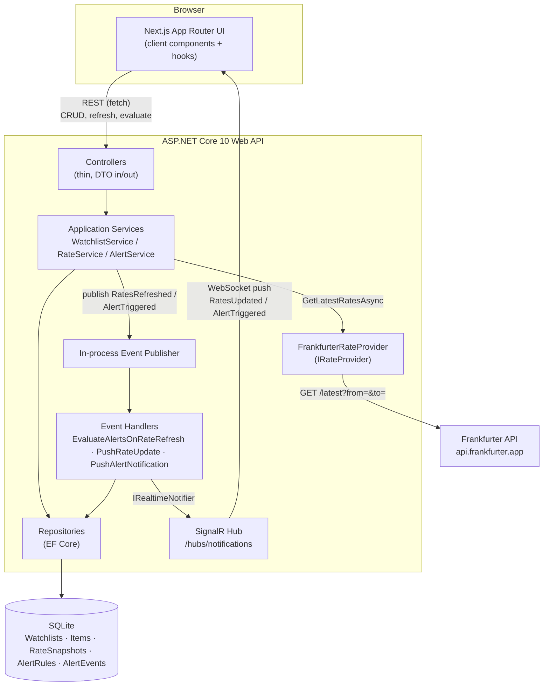
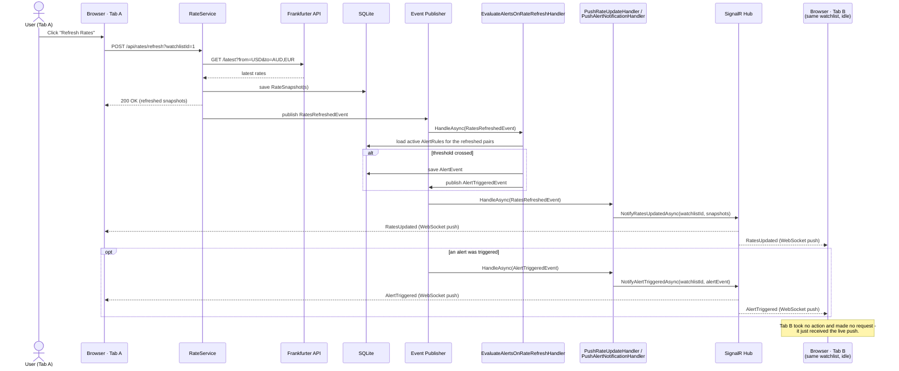
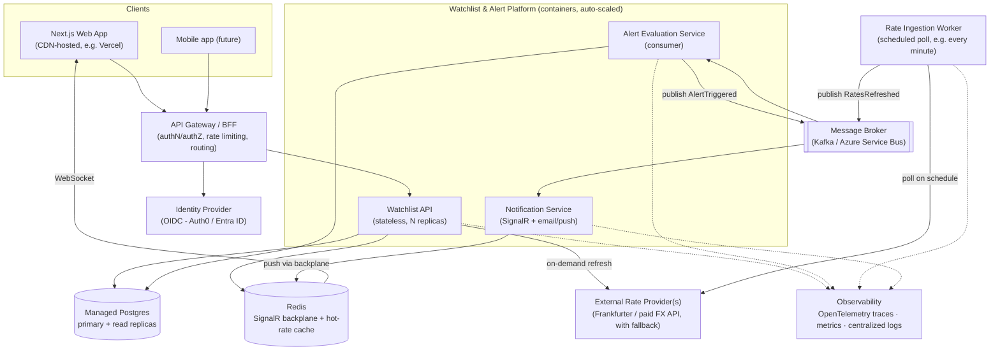

# Architecture

Two diagrams: the system as built for this exercise, and how it would look as a real, production, multi-tenant service.

## 1. This system

Clean-architecture .NET backend (Domain → Application → Infrastructure → Api) with an in-process event dispatcher that drives alert evaluation and pushes live updates to the Next.js frontend over SignalR, on top of normal REST calls for everything else.

**Why this shape:** the frontend and backend are event-driven without needing external infrastructure — an in-process publisher/handler pair inside the API drives the alert-evaluation workflow, and the same events are relayed live to any browser tab viewing the affected watchlist via SignalR, instead of the UI polling for changes. See the root README for the tradeoffs behind this choice (and why not MediatR/a message broker at this scale).

### Sequence: a refresh triggers an alert, pushed live to every open tab

One request (`POST /api/rates/refresh`) fans out through the event pipeline above and reaches a second, completely passive browser tab without it ever polling.

## 2. Real-world, enterprise-scale version

Same domain, but built for multiple tenants, high availability, and a much larger user base: ingestion is decoupled from the API via a message broker, evaluation runs as its own scalable consumer, and SignalR gets a backplane so it works across many API instances.

**What changes and why:**
- **Rate ingestion becomes its own service** on a schedule, independent of user traffic, so a slow/rate-limited external provider never blocks API requests.
- **A real message broker** (Kafka/Service Bus) replaces the in-process publisher so alert evaluation scales independently, survives API restarts, and can be retried/replayed.
- **SignalR gets a Redis backplane** so live updates work correctly across many API instances, not just one process.
- **Postgres with read replicas** replaces SQLite for concurrent write throughput and durability.
- **An API gateway + identity provider** add multi-tenant auth, which this exercise deliberately has none of.
- **Observability** (traces/metrics/logs) becomes essential once there's more than one instance to debug.
